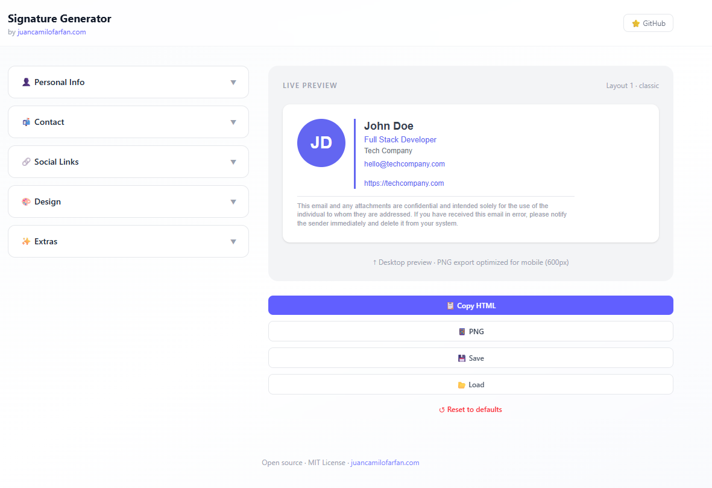
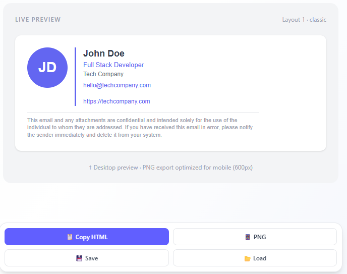
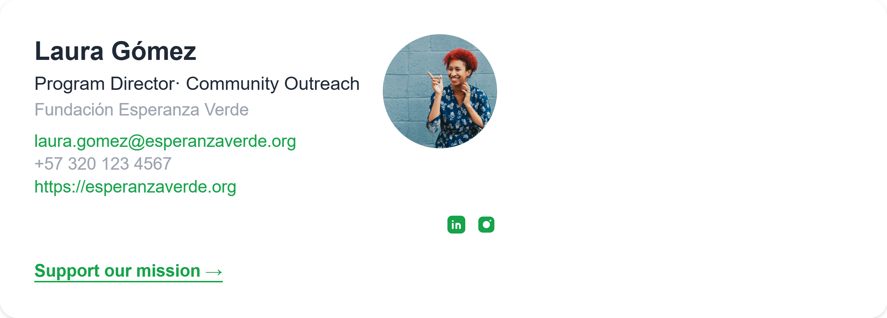

# jcd-signature-svelte-web

Open-source email signature generator (100% frontend, no backend).

- Export **HTML** ready for Gmail/Outlook
- Export **PNG** for mobile clients
- Save and load configuration as **JSON**

Part of the [Juancadev](https://juancamilofarfan.com) ecosystem.


## Current status

---

## Ejemplos y Capturas de Pantalla


### Capturas de pantalla

Vista de la aplicación:



Panel de exportación:



#### Resultados posibles (firmas generadas)

Ejemplos de firmas generadas con diferentes configuraciones:





### Archivos JSON de ejemplo

Puedes encontrar archivos de configuración de firma en `assets/json/`. Aquí tienes un ejemplo:

```json
{
  "firstName": "John",
  "lastName": "Doe",
  "jobTitle": "Full Stack Developer",
  "department": "",
  "company": "Tech Company",
  "email": "hello@techcompany.com",
  "officePhone": "",
  "mobilePhone": "",
  "website": "https://techcompany.com",
  "avatarUrl": "",
  "logoUrl": "",
  "social": {
    "linkedin": "",
    "twitter": "",
    "github": "",
    "instagram": "",
    "youtube": "",
    "whatsapp": ""
  },
  "ctaText": "",
  "ctaUrl": "",
  "layout": 1,
  "style": "classic",
  "primaryColor": "#6366f1",
  "textColor": "#374151",
  "linkColor": "#6366f1",
  "fontFamily": "Arial, sans-serif",
  "googleFontUrl": "",
  "fontSize": 14,
  "disclaimer": "This email and any attachments are confidential and intended solely for the use of the individual to whom they are addressed. If you have received this email in error, please notify the sender immediately and delete it from your system."
}
```

Archivos completos:
- [signature-config copy.json](assets/json/signature-config%20copy.json)
- [signature-daniel-castillo.json](assets/json/signature-daniel-castillo.json)
- [signature-dr.-andrés-morales.json](assets/json/signature-dr.-andrés-morales.json)
- [signature-laura-gómez.json](assets/json/signature-laura-gómez.json)

---

## Current status

- ✅ Section-based editor: Personal, Contact, Social, Design, Extras
- ✅ Real-time preview
- ✅ **6 templates** (`Template1` to `Template6`)
- ✅ **2 visual styles** (`classic`, `minimal`)
- ✅ Typography, size, and color controls
- ✅ Avatar and logo via file upload or URL
- ✅ Social links (LinkedIn, X/Twitter, GitHub, Instagram, YouTube, WhatsApp)
- ✅ Optional CTA (text + URL)
- ✅ Editable legal disclaimer
- ✅ Copy HTML to clipboard
- ✅ Download PNG
- ✅ Save/load configuration (`.json`)
- ✅ Reset to defaults

---

## Tech stack

| Technology | Role |
|---|---|
| SvelteKit 2 + Svelte 5 | Main framework |
| Vite 7 | Dev server and build |
| Tailwind CSS 4 | Styling |
| TypeScript | Typing and maintainability |
| `html-to-image` | PNG export |
| Wrangler + `@sveltejs/adapter-cloudflare` | Cloudflare Pages preview/build |
| ESLint + Prettier | Linting and formatting |

---

## Requirements

- Node.js 20+
- npm 10+

---

## Installation and local development

```bash
git clone https://github.com/juancadev-io/jcd-signature-svelte-web
cd jcd-signature-svelte-web
npm install
npm run dev
```

Open: `http://localhost:5173`

---

## Available scripts

```bash
npm run dev          # Development mode (Vite)
npm run build        # Production build
npm run preview      # Preview with Wrangler on port 4173
npm run check        # Type-check with svelte-check
npm run check:watch  # Type-check in watch mode
npm run lint         # prettier --check + eslint
npm run format       # prettier --write
npm run gen          # Generate Wrangler types
```

---

## Project structure

```text
jcd-signature-svelte-web/
├── static/
│   └── robots.txt
├── src/
│   ├── app.d.ts
│   ├── app.html
│   ├── lib/
│   │   ├── assets/
│   │   ├── components/
│   │   │   ├── ExportPanel/
│   │   │   │   └── ExportPanel.svelte
│   │   │   ├── FormPanel/
│   │   │   │   ├── FormPanel.svelte
│   │   │   │   ├── SectionWrapper.svelte
│   │   │   │   └── sections/
│   │   │   │       ├── ContactSection.svelte
│   │   │   │       ├── DesignSection.svelte
│   │   │   │       ├── ExtrasSection.svelte
│   │   │   │       ├── PersonalSection.svelte
│   │   │   │       └── SocialSection.svelte
│   │   │   ├── PreviewPanel/
│   │   │   │   └── PreviewPanel.svelte
│   │   │   └── Templates/
│   │   │       ├── SocialLinks.svelte
│   │   │       ├── Template1.svelte
│   │   │       ├── Template2.svelte
│   │   │       ├── Template3.svelte
│   │   │       ├── Template4.svelte
│   │   │       ├── Template5.svelte
│   │   │       └── Template6.svelte
│   │   ├── stores/
│   │   │   ├── defaults.ts
│   │   │   └── signatureStore.ts
│   │   ├── types/
│   │   │   └── signature.ts
│   │   ├── utils/
│   │   │   ├── colorContrast.ts
│   │   │   ├── exportHTML.ts
│   │   │   ├── exportPNG.ts
│   │   │   ├── fontUtils.ts
│   │   │   ├── socialIcons.ts
│   │   │   ├── styleConfig.ts
│   │   │   └── templateHelpers.ts
│   │   └── index.ts
│   └── routes/
│       ├── +layout.svelte
│       ├── +page.svelte
│       └── layout.css
├── eslint.config.js
├── package.json
├── README.md
├── svelte.config.js
├── tsconfig.json
├── vite.config.ts
└── wrangler.jsonc
```

---

## Functional flow

1. The user edits data in the form.
2. The global state (`signatureStore`) updates in real time.
3. `PreviewPanel` renders the signature based on template/style.
4. `ExportPanel` handles HTML copy, PNG export, and JSON config management.


---

## Contributing

PRs are welcome. For major changes, please open an issue first.

```bash
git checkout -b feature/my-change
```

---

## License

MIT · Made with ❤️ by [Juancadev](https://juancamilofarfan.com)